# Courier Behavior Tree

Questo documento descrive la struttura del behavior tree implementato per il robot courier.

## Struttura del Behavior Tree

```mermaid
graph TD
    Root["→ Sequence<br/>(Root)"]
    
    BatteryMgr["? Selector<br/>(Battery Manager)"]
    BatteryOK["✓ BatteryOK<br/>Condition (≥20%)"]
    GoCharge["⚡ GoCharge<br/>Action"]
    
    MissionSel["? Selector<br/>(Mission Selector)"]
    
    NavSeq["→ Sequence<br/>(Navigation)"]
    HasTarget["? HasTarget<br/>Condition"]
    NavToTarget["? Selector<br/>(Navigate to Target)"]
    
    ReachSeq["→ Sequence<br/>(Reach Target)"]
    IsAtTarget["✓ IsAtTarget<br/>Condition (≤0.15m)"]
    ClearTarget["🎯 ClearTarget<br/>Action"]
    
    MoveSeq["→ Sequence<br/>(Move to Target)"]
    RotCheck["? Selector<br/>(Rotation Check)"]
    IsAligned["✓ IsAligned<br/>Condition (≤0.15rad)"]
    Rotate["↻ RotateToTarget<br/>Action"]
    MoveToTgt["→ MoveToTarget<br/>Action"]
    
    GetWptSeq["→ Sequence<br/>(Get Next Waypoint)"]
    HasPath["? HasPathQueue<br/>Condition"]
    GetNext["📍 GetNextTarget<br/>Action"]
    
    Stop["⏹ StopRobot<br/>Action"]
    
    Root --> BatteryMgr
    Root --> MissionSel
    
    BatteryMgr --> BatteryOK
    BatteryMgr --> GoCharge
    
    MissionSel --> NavSeq
    MissionSel --> GetWptSeq
    MissionSel --> Stop
    
    NavSeq --> HasTarget
    NavSeq --> NavToTarget
    
    NavToTarget --> ReachSeq
    NavToTarget --> MoveSeq
    
    ReachSeq --> IsAtTarget
    ReachSeq --> ClearTarget
    
    MoveSeq --> RotCheck
    MoveSeq --> MoveToTgt
    
    RotCheck --> IsAligned
    RotCheck --> Rotate
    
    GetWptSeq --> HasPath
    GetWptSeq --> GetNext
    
    style Root fill:#e1f5ff,stroke:#333,stroke-width:2px
    style BatteryMgr fill:#fff4e6,stroke:#333,stroke-width:2px
    style MissionSel fill:#fff4e6,stroke:#333,stroke-width:2px
    style NavSeq fill:#e1f5ff,stroke:#333,stroke-width:2px
    style NavToTarget fill:#fff4e6,stroke:#333,stroke-width:2px
    style ReachSeq fill:#e1f5ff,stroke:#333,stroke-width:2px
    style MoveSeq fill:#e1f5ff,stroke:#333,stroke-width:2px
    style RotCheck fill:#fff4e6,stroke:#333,stroke-width:2px
    style GetWptSeq fill:#e1f5ff,stroke:#333,stroke-width:2px
    
    style BatteryOK fill:#e8f5e9,stroke:#333,stroke-width:2px
    style HasTarget fill:#e8f5e9,stroke:#333,stroke-width:2px
    style IsAtTarget fill:#e8f5e9,stroke:#333,stroke-width:2px
    style IsAligned fill:#e8f5e9,stroke:#333,stroke-width:2px
    style HasPath fill:#e8f5e9,stroke:#333,stroke-width:2px
    
    style GoCharge fill:#f3e5f5,stroke:#333,stroke-width:2px
    style ClearTarget fill:#f3e5f5,stroke:#333,stroke-width:2px
    style Rotate fill:#f3e5f5,stroke:#333,stroke-width:2px
    style MoveToTgt fill:#f3e5f5,stroke:#333,stroke-width:2px
    style GetNext fill:#f3e5f5,stroke:#333,stroke-width:2px
    style Stop fill:#f3e5f5,stroke:#333,stroke-width:2px
```



## Legenda

### Nodi di Controllo
- **→ Sequence**: Esegue i figli in sequenza. Successo se tutti i figli hanno successo.
- **? Selector**: Esegue i figli in ordine finché uno ha successo (fallback).

### Nodi Condizione (verdi)
- **BatteryOK**: Controlla se la batteria è ≥ 20%
- **HasTarget**: Controlla se esiste un target corrente
- **HasPathQueue**: Controlla se ci sono waypoint nella coda
- **IsAligned**: Controlla se il robot è allineato con il target (≤ 0.15 rad)
- **IsAtTarget**: Controlla se il robot ha raggiunto il target (≤ 0.15 m)

### Nodi Azione (viola)
- **GoCharge**: Simula ricarica batteria (+30% per tick)
- **GetNextTarget**: Preleva il prossimo waypoint dalla coda
- **RotateToTarget**: Ruota il robot verso il target
- **MoveToTarget**: Muove il robot verso il target
- **ClearTarget**: Cancella il target corrente
- **StopRobot**: Ferma il robot (goal raggiunto)

## Flusso di Esecuzione

### 1. Battery Manager
Prima di qualsiasi azione, il behavior tree controlla la batteria:
- Se **BatteryOK** (≥20%) → continua con la missione
- Se la batteria è bassa → esegue **GoCharge** per ricaricare

### 2. Mission Selector
Dopo aver verificato la batteria, il tree decide cosa fare:

#### Opzione A: Navigation (se ha un target)
Se **HasTarget** è true:
1. Controlla se è già al target con **IsAtTarget**
   - Se sì → **ClearTarget** (lo rimuove)
   - Se no → esegue la sequenza di movimento:
     - Verifica allineamento con **IsAligned**
       - Se non allineato → **RotateToTarget**
       - Se allineato → passa oltre
     - Esegue **MoveToTarget**

#### Opzione B: Get Next Waypoint (se non ha target)
Se non ha target ma **HasPathQueue** contiene waypoint:
- Esegue **GetNextTarget** per prelevare il prossimo waypoint

#### Opzione C: Stop (goal raggiunto)
Se non ha target e la coda è vuota:
- Esegue **StopRobot** per fermare il robot

## Vantaggi dell'Approccio con Behavior Tree

### 1. **Modularità**
Ogni comportamento è isolato in un nodo riutilizzabile:
```python
class BatteryOK(py_trees.behaviour.Behaviour):
    # Può essere riutilizzato in altri behavior tree
    # Può essere testato indipendentemente
```

### 2. **Reattività**
Il tree viene ricalcolato ad ogni tick, permettendo decisioni reattive:
- Se la batteria scende sotto il 20%, interrompe l'azione corrente e va a caricare
- Le condizioni vengono rivalutate continuamente

### 3. **Facilità di Debug**
Ogni nodo può loggare il proprio stato:
```python
self.feedback_message = f"Battery OK: {battery_level:.1f}%"
```

È possibile visualizzare lo stato dell'intero tree:
```python
py_trees.display.unicode_tree(self.behavior_tree, show_status=True)
```

### 4. **Estendibilità**
Facile aggiungere nuovi comportamenti:
- Aggiungi un nuovo nodo condizione (es. `ObstacleDetected`)
- Aggiungi un nuovo nodo azione (es. `AvoidObstacle`)
- Riorganizza la struttura senza modificare i nodi esistenti

### 5. **Gestione della Complessità**
Invece di una lunga serie di if-else, la logica è organizzata gerarchicamente:
```python
# Vecchio approccio procedurale
if battery_low:
    charge()
elif has_target:
    if not_aligned:
        rotate()
    else:
        move()
elif has_path:
    get_next_waypoint()
else:
    stop()

# Con behavior tree: la struttura è self-documenting
root = Sequence([
    battery_manager,  # Gestisce batteria
    mission_selector  # Gestisce missione
])
```

## Blackboard

Il **blackboard** è la memoria condivisa tra i nodi:

### Variabili nel Blackboard
- `battery_level`: Livello batteria (0-100%)
- `current_target`: Target corrente (x, y) o None
- `path_queue`: Lista di waypoint rimanenti
- `angle_diff`: Differenza angolare con il target (rad)
- `distance_to_target`: Distanza dal target (m)
- `cmd_vel_publisher`: Funzione per pubblicare comandi di velocità
- `logger`: Logger ROS2

### Accesso al Blackboard
```python
# Lettura
battery_level = self.blackboard.get("battery_level")

# Scrittura
self.blackboard.set("battery_level", new_level)
```

## Integrazione con ROS2

Il behavior tree è integrato nel nodo ROS2 `CourierController`:

### Inizializzazione
```python
self.behavior_tree = create_courier_behavior_tree(cell_size=self.cell_size)
self.behavior_tree.setup_with_descendants()
self.blackboard = py_trees.blackboard.Client(name="CourierController")
```

### Control Loop
```python
def control_loop(self):
    # Aggiorna stato nel blackboard
    self.update_blackboard_state()
    
    # Tick del behavior tree (una volta)
    self.behavior_tree.tick_once()
```

### Pubblicazione Comandi
I nodi azione usano la funzione wrapper per pubblicare comandi:
```python
cmd_vel_pub = self.blackboard.get("cmd_vel_publisher")
msg = Twist()
# ... configura msg ...
cmd_vel_pub(msg)
```

## Esempio di Esecuzione

### Scenario: Robot con batteria al 100%

**Tick 1:**
1. ✓ BatteryOK (100% ≥ 20%) → SUCCESS
2. ✗ HasTarget (no target) → FAILURE
3. ✓ HasPathQueue (4 waypoints) → SUCCESS
4. ✓ GetNextTarget → SUCCESS (target impostato)

**Tick 2:**
1. ✓ BatteryOK (98% ≥ 20%) → SUCCESS
2. ✓ HasTarget → SUCCESS
3. ✗ IsAtTarget (5.2m > 0.15m) → FAILURE
4. ✗ IsAligned (0.8rad > 0.15rad) → FAILURE
5. ↻ RotateToTarget → RUNNING

**Tick 3-10:**
- Continua a ruotare finché IsAligned → SUCCESS

**Tick 11:**
1. ✓ BatteryOK (95%) → SUCCESS
2. ✓ HasTarget → SUCCESS
3. ✗ IsAtTarget (4.8m) → FAILURE
4. ✓ IsAligned (0.05rad) → SUCCESS
5. → MoveToTarget → RUNNING

**Tick 12-50:**
- Continua a muoversi finché IsAtTarget → SUCCESS

**Tick 51:**
1. ✓ BatteryOK (85%) → SUCCESS
2. ✓ HasTarget → SUCCESS
3. ✓ IsAtTarget (0.08m) → SUCCESS
4. 🎯 ClearTarget → SUCCESS

**Tick 52:**
- Ripete il ciclo per il prossimo waypoint...

### Scenario: Batteria Bassa (15%)

**Tick X:**
1. ✗ BatteryOK (15% < 20%) → FAILURE
2. ⚡ GoCharge → SUCCESS (batteria → 45%)

**Tick X+1:**
1. ✓ BatteryOK (45% ≥ 20%) → SUCCESS
2. Riprende la missione...

## Personalizzazione

### Modificare le Soglie
```python
# In courier_behavior_tree.py
battery_ok = BatteryOK(name="BatteryOK", battery_threshold=30.0)  # 30% invece di 20%
is_aligned = IsAligned(name="IsAligned", angle_tolerance=0.1)     # Più preciso
```

### Aggiungere Nuovi Comportamenti
```python
class ObstacleDetected(py_trees.behaviour.Behaviour):
    """Condizione: controlla se c'è un ostacolo"""
    def update(self):
        # Leggi sensori laser/camera
        if obstacle_detected:
            return Status.SUCCESS
        return Status.FAILURE

class AvoidObstacle(py_trees.behaviour.Behaviour):
    """Azione: evita ostacolo"""
    def update(self):
        # Logica per evitare ostacolo
        return Status.SUCCESS
```

### Modificare la Struttura
```python
# Aggiungi gestione ostacoli prima del movimento
obstacle_sequence = Sequence("Obstacle Check", memory=False)
no_obstacle = Inverter(ObstacleDetected())
obstacle_sequence.add_children([no_obstacle, move_to_target])
```

## Testing

### Test di un Singolo Nodo
```python
def test_battery_ok():
    blackboard = py_trees.blackboard.Client()
    blackboard.set("battery_level", 50.0)
    
    node = BatteryOK(battery_threshold=20.0)
    node.setup()
    
    assert node.update() == Status.SUCCESS
```

### Test del Tree Completo
```python
def test_behavior_tree():
    tree = create_courier_behavior_tree()
    blackboard = py_trees.blackboard.Client()
    
    # Setup iniziale
    blackboard.set("battery_level", 100.0)
    blackboard.set("path_queue", [(1, 0), (2, 0)])
    
    # Tick e verifica
    tree.tick_once()
    # Assert sullo stato...
```

## Confronto: Prima vs Dopo

### Prima (Approccio Procedurale)
```python
def control_loop(self):
    if self.current_target is None and not self.path_queue:
        self.stop_robot()
        return

    if self.current_target is None and self.path_queue:
        next_cell = self.path_queue.pop(0)
        target_x = (next_cell[0] + 0.5) * self.cell_size
        target_y = (next_cell[1] + 0.5) * self.cell_size
        self.current_target = (target_x, target_y)

    if self.current_target:
        self.move_to_target(self.current_target)
```
❌ Tutto in un metodo  
❌ Difficile aggiungere nuovi comportamenti  
❌ Logica sparsa in vari if-else  

### Dopo (Behavior Tree)
```python
def control_loop(self):
    self.update_blackboard_state()
    self.behavior_tree.tick_once()
```
✅ Logica organizzata in un tree  
✅ Nodi riutilizzabili e testabili  
✅ Facile da estendere  
✅ Self-documenting  

## Conclusione

Il behavior tree semplifica drasticamente la gestione delle decisioni del robot:
- **Modularità**: ogni comportamento è un nodo isolato
- **Reattività**: decisioni prese ad ogni tick
- **Manutenibilità**: facile aggiungere/modificare comportamenti
- **Scalabilità**: la struttura si adatta a progetti complessi

Questo è lo stesso pattern usato nei videogiochi AAA e nei robot industriali per gestire comportamenti complessi in modo mantenibile.
